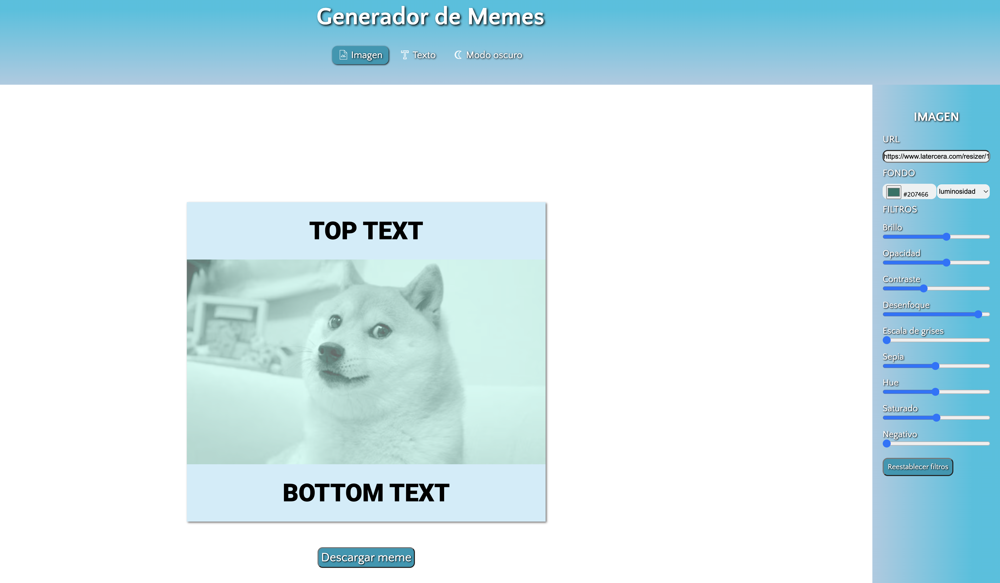
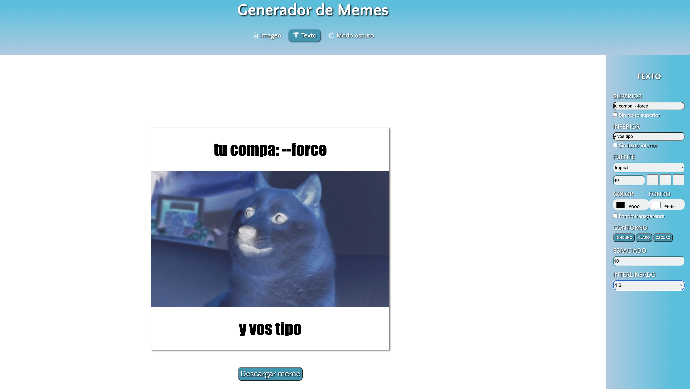
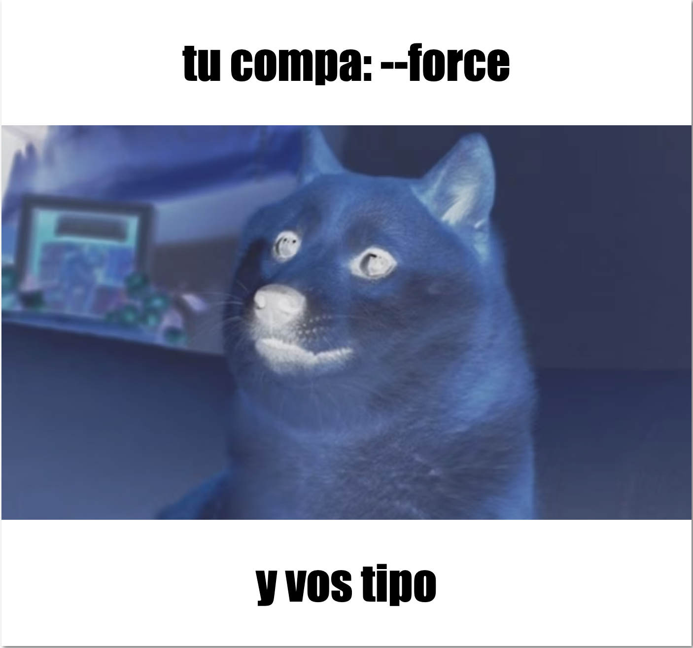

# Generador de Memes

Este proyecto toma imagenes a través de una url, las cuales se pueden modificar en cuanto a color y texto con el fin de generar un "meme" para descarga. Es mi primer acercamiento a Javascript y allí implementé los conocimientos que fui adquiriendo. 

Consta de cuatro partes:

1. [Nav/Bar](#NavBar)
2. [Panel Imagen](#Panelimagen)
3. [Panel Texto](#Paneltexto)
4. [Meme contenedor](#Memecontenedor)

> *Las metodologías utilizadas fueron HTML, CSS y Javascript junto a las librerias fileserver y  DOM to image para lograr la descarga del meme que se haya creado.*

## Nav Bar 

La barra de navegación contiene el panel de texto, de imagen y la opción del modo claro/oscuro, los cuales se van intercambiando con su evento click correspondiente. 

## Panel imagen 

En esta sección se ingresa por URL una imagen que será el template del meme, se aplica un color de fondo para implementar los modos de fusión de imagen junto *(o no)* con los filtros según las preferencias del usuario; adicionalmente se incluyó el botón de reestablecer los filtros de la imagen devolviéndola a su estado original. 

> *Esto se logró mediante eventos input, click y change.*

## Panel texto 

Este panel contiene varias funcionalidades que modifican el texto ya sea el contenedor del mismo o todo lo relacionado con la fuente, tipo de fuente, tamaño, color, contorno y fondo. 

> *Además de los eventos mencionados se usaron condicionales para ocultar el texto o transparentar el fondo del box en donde iría el texto ingresado*

## Meme contenedor 

Una vez ingresada la imagen, realizado los cambios de color o filtros en la misma y al haber modificado el texto según las preferencias el meme está listo para descargar. 

> *Se utilizó la biblioteca dom-to-image para generar una imagen a partir del contenido del contenedor del meme y fileserver para que dicha imagen se pueda guardar en el ordenador con formato PNG y el nombre  "meme.png".*

 

Eso es todo, por ahora! 

✨ Gracias por tu visita ✨ 

